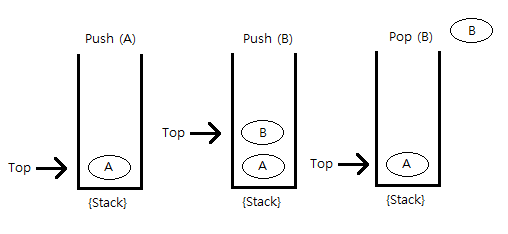

# 08_25 수업정리

## 목차

- [08_25 수업정리](#08_25-수업정리)
  - [목차](#목차)
  - [용어 정리 해야할 것들](#용어-정리-해야할-것들)
  - [ArrayList = Vector](#arraylist--vector)
    - [개인적 궁금한것](#개인적-궁금한것)
  - [자료구조 - Collection?](#자료구조---collection)
  - [Interface List `<E>`](#interface-list-e)
  - [Interface Queue `<E>`](#interface-queue-e)
  - [Interface Map `<K,V>`](#interface-map-kv)
  - [Interface Set `<E>`](#interface-set-e)
  - [Autoboxing and Unboxing](#autoboxing-and-unboxing)
  - [Exception 처리](#exception-처리)
    - [Exception의  2가지](#exception의--2가지)
  - [Inner class](#inner-class)

--- 

## 용어 정리 해야할 것들
	Collection class
	자료구조 - Collection 
	Stack = FILO - 첫번째 들어간것은 마지막에 나온다. ex) 컵 
	Queue = FIFO - 첫번째 들어가면 첫번째로 나온다. ex ) 터널
	StackTrace
	thread - 추적
	inherited 
	핸들링 - 처리

## ArrayList = Vector 
ArrayList와 Vector는 interface - List`<E>`를 받는다.  
약간의 추가적 기능은 있지만 List의 메서드를 기본적으로 알고있다면 List 인터페이스를 받는 class는 대부분 쓸수 있다. 

```java
List l = new Vector();
	     new ArrayList();
```
### 개인적 궁금한것
List는 인터페이스가 아닌가??? 인터페이스도 데이터 타입으로 가능한가?

> **interface, abstrect로 데이터타입으로 가능하나, 인스턴스생성이 불가능 하다. 데이터 타입으로 선언을 한다면 인터페이스의 오버라이딩 된 기능은 사용할수 있다.

## 자료구조 - Collection?

**Stack** 
- FILO   
  첫번째 들어간것은 마지막에 나온다.  
  ex) 컵
	
**Queue** 
- FIFO   
  첫번째 들어가면 첫번째로 나온다.  
  ex) 터널

## Interface List `<E>`   
index구조 관리 함.    
List를 implements한 class는 어느정도 쓸 수 있다.  
첫번째 들어간 것은 마지막에 나온다. 
>사용 class :  Stack `<E>` 

- **push(E item)**  
item을 prepend 한다. 말 그대로 푸쉬 해서 맨위로 밀어 넣는 의미를 가진 메서드. 
- **size()**  
저장된 data(item)의 개수
- **pop()**  
맨 위에 있는 개체를 제거하고 해당 개체를 이 함수의 값으로 반환한다.  
- **peek()**  
맨 위에 있는 개체를 제거하지 않고 이 스택의 맨 위에 있는 개체를 말한다.
- **isEmpty()**  
Vector 의 메서드. 저장된 data의 수가 0 이면 true 

  ```java 
  if(stack.isEmpty()){
      ...
  }
  //아래와 같은 의미
  if(stack.size() == 0;){
      ...
  }
  
  ```

**pop()과 peek()의 차이점은 그 값을 없애냐 없애지않냐의 차이가 있다.**
 


## Interface Queue `<E>`
첫번째 들어간 것은 첫번째로 나온다.
> 사용 class :  LinkedList `<E>`

- **offer(E item)**   
item을 순서대로 append한다.
- **poll()**  
첫번째 요소를 검색하고 제거한다.
- **peek();**  
첫번째 요소를 검색하지만 제거하지 않는다.

## Interface Map `<K,V>`  
맵 구조의 data 저장  
> 사용 class : Hashtable`<K,V>`

- **put(K key, V value)**  
지정된 값을 이 맵의 지정된 키와 연결한다.
- **get(Object key)**  
지정한 키가 매핑되는 값을 반환하거나, 이 지도에 키에 대한 매핑이 없는 경우 null을 반환한다.
- **containsKey(Object key)**  
이 지도에 지정된 키에 대한 매핑이 포함되어 있으면 true를 반환한다.
- **containsValue(Object value)**  
이 해시 테이블이 하나 이상의 키를 이 값에 매핑하면 true를 반환한다.

## Interface Set `<E>` 
자료를 관리하는 개념으로 `중복된 것을 제외`하고 받는다.
> 사용 class : HashSet `<E>`
  
- **add(E e)**  
지정한 요소가 아직 없는 경우 이 세트에 추가합니다(선택 사항 작업).
- **contains(Object o)**  
이 집합에 지정된 요소가 포함되어 있으면 true를 반환합니다.
 
 **equals()와 차이**
```java
if( hashSet.contains("b") ){
 ...
}

for(int = i =0; i hashSet.length; i++){
 if ( hashSet[i].equals("b") ){
   ...
 }
}
```

- **remove(Object o)**  
저장된 data에서 파라미터 값을 삭제한다.


## Autoboxing and Unboxing
래퍼 클래스의 활용
>제네릭과 환상
```java
// java 1.5 이전
int i = 1;
Integer integer = new Integer(i);
int j = integer.intValue();
```

```java
// java 1.5 이후
Integer integer = 1;
int j = integer;
```

## Exception 처리
견고한 app을 만들 수 있다?

### Exception의  2가지
Checked, Unchecked로 구분할 수 있다.
- **Checked Exception**  
  - `RuntimeException`을 상속하지 않는 클래스
  - 반드시 예외 처리
  - 컴파일 시점
  - `IOException`, `ClassNotFoundException` 등
- **Unchecked Exception**
  - `RuntimeException`을 상속하는 클래스
  - 런타임 시점 
  - 명시적으로 하지 않아도 됨
  - `NullPointerException`, `ClassCastException` 등
  


**StackTrace**  
실행했는데 문제가 발생하면 jvm이 예외가 발생한 부분에 `new Exception` 을 생성하고 `Throw` 라는 키워드로  에러를 던져준다.

- **try-catch**  
문제가 발생하면 catch를 해서 해결하는 메서드?   
다중캐치를 할땐 하위를 맨위로 맨 아래는 다 잡을수 있는 Exception 생성  
**catch는 무조건 Throwable 부터 가능**

- **try-catch-finally**  
예외처리가 발생하던 하지않던 **무조건** 실행해야 하는 것을 finaly에 해야한다.
- **throws**  
던져주는 역활을 하는 키워드  
에러 부분에 호출 부분에 던져줌으로 안에서 메서드에서 끝나는것이 아닌 호출부에서 끝나게 된다.   
-throws 하면 어찌됬던 **try-catch** 한테 던져야함.

- **throw**  
예외를 발생시키는 키워드


```java 
try{
    ...
}catch(Exception e){
    ...
}finally{
	System.out.println("여기는 fileRead() :: Exception이 발생하던 말던 나는 실행");
}
```
**뒤에 작성하는것과의 차이 ...**
> 만약 `try-catch`에 `return` 한다면 `finally`은 **실행**하고 뒤에 붙은것은 실행 하지않는 것의 차이
 

## Inner class 
클래스안에 클래스가 있는것.
- $ - Member     
클래스 안에 field와 method 가 있어야 하는데 class 가 있는 구조  

- $1 - local   
클래스 안에 field와 method가 있는데 method 안에 클래스가 들어있는 구조.  

- $Number - Anonymous (어나너머스)  
익명
  ```java 
  // java 문법
  public class B extends A{
    public void def(String message){
      System.out.println("::Hi"+message);
    }
  }
  new B().abc("Hello");
  ```
  ```java 
  // Anonymous java 문법
  new A(){
    public void def(String message){
      System.out.println("::Hi"+message);
    }
  }.abc("Hello");
  ```
