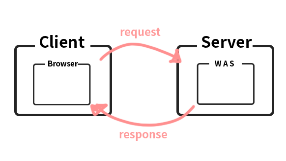

09_06 수업정리
===

## 용어
    servlet & jsp - web을 지원하는 bean
    c/s = client / server

<br/>

# URI &  URL


- URI - Uniform Resource Identifier
- URL - Uniform Resource Locator
- URN - Uniform Resource Name
  
자원의 식별자(URI), 위치(URL), 이름(URN)으로 유추해 볼 수 있다.


예를들어 `https://www.google.com/search?q=url+uri` 라는 주소가 있으면  
`https://www.google.com/search` 여기까지가  URL 이면서 URI에 속해있고,   
`https://www.google.com/search?q=url+uri`가 URI 


# jar 와 war

**jar**  
bean을 묶어 놓은 압축 파일  

**war**  
was에 표준화된 servlet directory를 묶어 놓은 압축 파일

<br/>

# Client & Server

client - browser  
server - web server

브라우저를 통해 url 을 서버에 전송하면  
웹 서버에서 url의 경로를 찾아가 정보를 브라우저에 전송함

**browser** 
- http프로토콜을 이용해 url을 web c/s 로 전송을 하는 app
- html을 parsing 하고 화면에 출력하는app

**web server**
- url을 c/s로 내보내고 resource 관리하는 server app



## c/s 프로그램의 3개의 조건

- 도메인or IP (식별성 & 주소)
- port
- protocol

<br/>

# Servlet & JSP 
servlet과 jsp 는 **bean**이라 실행이 되지 않는다.  
그래서 java에서  **servlet container** 와 **JSP container**를 지원해줌    
    
## 그래서 Servlet , JSP 이 뭔데?????
**J2SE IOPackage로 browser에게 HTML을 보내는 기술**  

## URL Hiding
url 부분에 상세한 정보를 볼수 없게 바꿀수 있다. 
```xml
<servlet>
    <servlet-name>FirstServlet</servlet-name>
    <servlet-class>FirstServlet</servlet-class>
</servlet>

<servlet-mapping>
    <servlet-name>FirstServlet</servlet-name>
    <url-pattern>여기에요 여기!!</url-pattern>
</servlet-mapping>
```
# WAS - Web Application Server
**Java servlet and JSP container**  
servlet container, jsp container, web server를 구동할수 있게 소프트웨어를 제공
> WAS의 스팩은 Servlet의 version
## Platform
- **tomcat** 
- WebSphere :IBM  
- Weblogic :Oracle 
- JBoss(Wildfly) :RedHat
- 등등등

## 표준화된 폴더구조
**class Path는 classes로 defult 되어 있다.**
```bash
[Tomcat home]
    └── webapps
            └── examples 
                ├── ~~.html , ~~.jsp
                └── WEB-INF
                        ├── ~~.xml
                        └── classes
                                └── ~~.java , ~~.class
```
**다른 명칭**
- servlet directory
- webapplication
- Servlet Engine 
- Servlet Context
