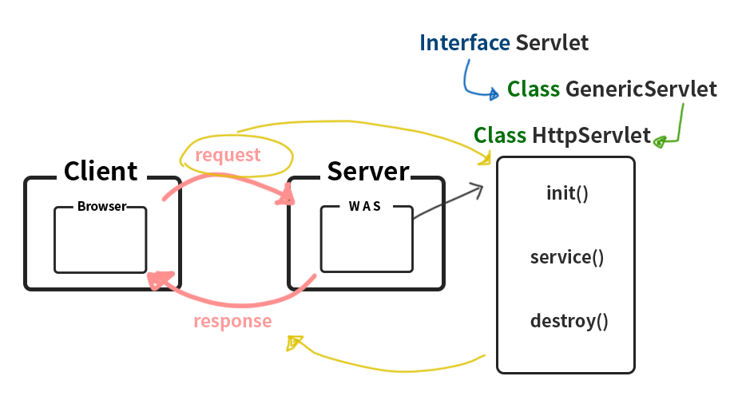

09_07
====
## 용어
    Life cycle

# HTTP Protocol
Client와 Server간에 두가지 메세지(HTTP요청 , HTTP응답)를 주고받을 수 있는 수단


- Header
  >Header는 request ,response 대한 정보를 포함한다.   
  1. 일반 Header  
  생성된 날짜 및 시간 등과 같은 HTTP 통신에 대한 일반적인 정보가 포함 된다.

  2. **request / response Header**  
   서버에 요청하면 요청 Header가 있고 client/browser 로 보낼때 응답 Header가 있다.  
   **URL, Method(GET, POST, HEAD)**, 요청 생성에 사용된 브라우저 및 기타 정보와 같은 요청에 대한 정보가 포함.

  3. Entity Header  
    실제 메세지, 전송중인 HTTP 본문에 대한 정보가 포함. 컨텐츠 길이, 컨텐츠 언어, 인코딩, 만료날짜, 중요한 정보같은 것을 포함.
   
- Body 
  > 응답(response) 할 컨텐츠 또는 메세지를 나타낸다. 콘텐츠에는 요청한 리소스에 따라 HTML코드, 이미지, 등등 여러가지를 가져올 수 있다.

## GET , POST 
- GET   
  default 방식 . **URI가 다 나온다.**
- POST  
  가시적 보안을 요구할 때 사용. **URI에 나오지 않는다.**
# Servlet & JSP 

## Servlet의 약속
servlet container는 개발자가 생성한 메서드가 뭔지 모르기 때문에 container와의 문법이 있다.
- init()  
  >초기 생성시 한번만 호출
- Service()
  >Client에서 request 받으면 response하는 구조   
  메서드가 끝나면 null 처리를 하지 않고 재사용을 한다.
- destroy()
  >xml이나 servlet를 수정하고 conpile을 하면 발생.  
  수정뿐만이 아닌 close 시에도 가능???
  
<br/>

**WAS에게 request가 들어오면 Thread로 대응하기 떄문에 초기 실행시 Thread를 생성하고 run()를 자동 생성하고 strat()를 호출하는 구조. run()안에 init,sevice, destroy가 들어있다.**  



<br/>

이 3개의 매서드는 `Interface Servlet`이 갖고있는 메서드이다. 하지만 여러 확장성을 통해 내가 생성하고자 하는 servlet에도 3가지 메서드가 있어야 하기에 확장성을 갖은 `GenericServlet` , `httpServlet` 를 사용하는데 구현받은 class들에 **이미 Overriding**되어 있기 때문에 안해줘도 프로그램은 돌아가나 **error**가 발생한다. **(source 참고)**

## Servlet request
Client가 Browser로 HttpProtocol로 요청을 하면 protocol에서 Client의 입력받은 정보를 servlet에게 request라는 객체로 전송한다.

## Servlet response
Client가 Browser로 HttpProtocol로 요청을 하면 protocol에서 Client의 입력받은 정보를 servlet에게 request라는 객체로 전송할 때 응답할 수 있는 객체를 생성해서 전송한다.

## Overriding
service를 overring 하지 않으면 doGet() 이나 doPost()를 overriding 해야 한다. 그 이유는 위에 설명.

## 종속적이지 않는 URL
IP(Host)에 종속적인 URL 형태
```
http://127.0.0.1:8080/edu/index.html
```

ULI에 종속적인 형태
```
/edu/index.html
```
Relative URI
```
index.html
```
