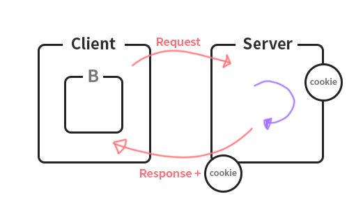

09_10 수업정리
====

# Cookie & Session
Cookie, Session 은 브라우저 기술이다.

## Stateless protocol (무상태 프로토콜)
브라우저에서 서버로 요청과 응답을 보낸 후 계속 연결해 있는 것이 아닌 끊겨 있는 것을 말한다.   
한마디로 무상태 프로토콜은 서버가 여러 요청에게 세션 **정보나 상태 보관을 요구하지 않기 때문에 이전에 무엇을 했고, 지금 무엇을 했는지에 대한 정보를 갖고 있지 않는다**는 뜻이다.

## **Cookie**
> Class
### 배경
로그인을 통해 볼수있는 서비스가 많아짐으로 요청받은 정보가 유지 되야 하는 서비스가 많아졌는데 무상태 프로토콜의 단점을 해결하기 위해 생김
### Cookie란...
서버가 브라우저에게 사용자의 로컬 컴퓨터에 파일또는 메모리에 저장하는 작은 기록 정보 파일.  
사용자가 같은 웹사이트에 방문할때마다 읽히고 새로운 정보로 바꿀 수 있다.  
쿠키는 **[name = value]인 형태로 Map구조**로 되어있고, **PC의 종속적인 형태**이다.
그리고  
쿠키에 대한 정보를 매 헤더(Http Header)에 추가하여 보내기 때문에 상당한 트랙픽을 발생시키고,
결제정보등을 쿠키에 저장하였을때 쿠키가 유출되면 보안에 대한 문제점도 발생할 수 있다.



request의 정보를 cookie에 담아 브라우저에게 보내주는 것.

**API 한번 찾아볼 것**

## **Session**
> interface
### 배경 
쿠키의 문제점들을 해결하기 위해 등장

### Http Session이란...

HTTP Session **id를 식별자로 구별**하여 데이터를 사용자의 브라우저에 파일 형태가 아닌 cookie형 메모리로 저장되어 가지고 있다. 메모리 형태기때문에 브라우저가 종료되면 사라지는 형태이다.

### 절차

- 클라이언트가 서버에 Resource를 요청을하면 서버에서는 Request를 통해 쿠키에서 getSession으로 확인을 한 후에 없으면 Set-Cookie를 통해 새로 발행한 Session-id 보냅니다.   
- 클라이언트는 HTTP Request 헤더에 Session id를 포함하여 원하는 Resource를 요청을 합니다.  
- 서버는 Session id를 통해 해당 세션을 찾아 클라이언트 상태 정보를 유지하며 적절한 응답을 합니다.

    ***getSession 은 서버에 생성을 하게 되는 경우 true를 반환, 있으면 False 를 반환**  

# Servlet - part 5

## 동기화 문제
```java
int a = 0;

service (){
    int b = 0;
    a++;
    b++;
}
```
동시 접속시 과연 a는 몇까지 올라갈 것이며 b는 몇이 될까? 

>초기에 이것을 해결하고자 **SingleThreadModel**이라는 interface를 만들었는데 또 문제점이 발생하고 만다. 하나의 Thread가 돌면 나머지는 pool에 들어가는 현상이 발생해서 SingleThreadModel는 사용하지 않는 인터페이스가 되었다.

그래서 **association** 관계가 아닌 **dependency** 관계를 형상한다.

## 선언적 예외 처리
개발자의 실수로 인한 Exception은 throws하고 xml 에서 처리

```xml
<error-page>
    <error-code>405</error-code>
    <location>/jw05/405ErrorDisplay.html</location>
</error-page>

<error-page>
    <exception-type>java.lang.NullPointerException</exception-type>
    <location>/NullErrorDisplay</location>
</error-page>
```