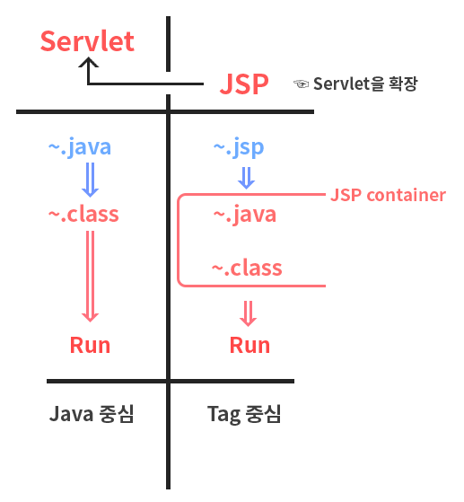

09_13 수업정리
====

# JSP 

## JSP 변환 규칙

1. Directives Tag  
   자바를 구성하는데 쓰이는 태그 
   1. `<%@ page ... %>` 
      > 페이지의  종속적인 속성들을 정의.
       -  **import => 선택**
       -  **contentType => 한국인이라면 필수!**
       -  language => Default = java
       -  session => Default = true
       -  info => toString 같은 역활 ( 호출필요 )
       -  extends => 상속 (안씀)
       -  autoFlush => Default = true
       -  buffer => Default = 8kb
       -  errorPage => error 발생시 "주소" 로 이동
       -  isErrorPage => true 시 error 페이지
   1. `<%@ include file... %>`  
      > 로드될때 종적으로 파일을 include.
   2. `<%@ taglib ... %>`  
      > 페이지에서 사용될 사용자의 액션을 포함하는 태그 라이브러리 선언.
2. **Scriptlet Tag**  
   자바 내부에 쓰이는 태그
   1. `<% %>`
        > JSP 안에 java 코드 넣기 위해 사용. 
   2. `<%= %>`
        > Web browser에 결과값을 출력하기 위해 사용
   3. `<%! %>`
        > field의 전역변수 or 메서드
3. Standard Tag (나중에)