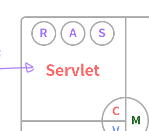
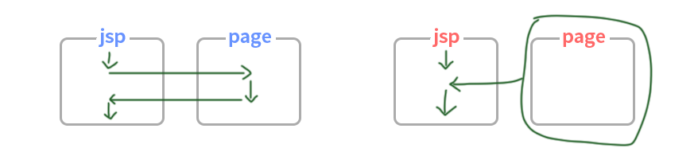

09_14 수업정리
====

# MVC - part 1
> Model , View , Controller

## 배경
jsp에서 화면을 구성시 java가 섞여있다. 하지만 jsp는 화면을 구성하는 단으로 속성값?..의마가 다르므로 그것을 모듈화 하기 시작했다. presentation logic에  `jsp, servlet` 으로 모듈화했다.

- Model  
  **data**를 다루는 beans을 칭한다
- View  
  **jsp** 화면에 보여지는 앞단을 칭한다
- controller  
  **Client**로부터 **Request**을 받은 것을 Model에 전송하고 받은 값을 view에 전송하는 **servlet**을 칭한다.

## Controller에 대해 
1. **Business logic**에 연결 => 메서드 호출
2. **Model과 View**의 연결 => Object Scope
3. **Navigation** => Forword / sendredirect 
4. **공통 / 선처리** => Work Flow Controll 경로 이탈 방지, 다른경로로 접근시 불가능(**방어적   코딩**)   
   한글처리

# Object Scope
> 속성을 공유할 수 있는 유효범위에서 데이터를 공유하여 사용할 수 있는 내장 객체들을 영역객체라고 한다.

## 내장객체란?
- application - ServletContext
- session - HttpSession
- request - HttpServletRequest
- page

## 영역별 공간
1. application Object Scope   
   > ~~server의 저장공간 (공유)~~ ServletContext!
    
    server를 내리기 전까지 유효, 모든 Client가 사용 가능 **(동기화 문제 발생)**  
    **server를 내리면 날아감**

2. Session Object Scope   
   > Client의 저장 공간

    브라우저에 세션이 유지되는 동안 유효, 자신만 접근 가능   
    **브라우저를 종료시 날아감**

3. Request Object Scope   
   > 요청의 저장 공간

   response 하기 전까지 유효   
   **response시 날아감**

    

# JSP ++추가

## **<jsp:include page > :: <%@ include file %>**
 > url 이 변경되지않음

- **<jsp:include page >**  - 동적   
  jsp에서 page로 갔다 온다.  
`<jsp:param name="abc"value="<%=abc%>"/>` 로 Object Scope할 수 있다.

- **<%@ include file %>**  - 동적   
  jsp안에 file을 불러온다

## **`<jsp:forwrad page >`**
> url이 변경되지 않는다  

수행 중 forward를 만나면 page로 넘어가고 원래 있던 jsp의 buffer를 clear 한다.

## **response.sendRedirect("이동페이지")**
> url이 변경 된다.
> 

수행 중 sendRedirect 만나면 reponse 하고 다시 ("이동페이지")로 request한다.

# CRUD 
 - C => Insert
 - R => Select
 - U => Update
 - D => Delete

