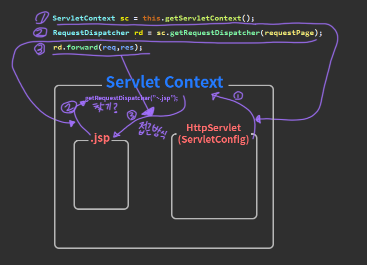

09_15 수업정리
====

오늘은 나눠준 소스나 이런것이 없다.. workspace에서 모든 작업을 해 빼오기가 애매함 😥

# MVC - part 2

## Servlet Context
 표준화 된 폴더구조 [servlet link](https://github.com/ohchangyeol/bitcamp/tree/main/09_06)  
 한마디로 프로젝트를 칭하는 느낌인것같다. 프로젝트의 html , jsp , servlet 등 되게 많이 들어있다한다.

## Servlet Config ?
web.xml ..?

## Interface 
- RequestDispatchar  
  >servletContext에 접근 하려는 네비? 같은게 들어있는 인터페이스 ? 경로를 이동해주는 인터페이스 ..?
- ServletConfig
  >`getServletContext()`   
  자신이 속한 servletContext를 찾는것 같은 느낌이다. 그럼 Config는 httpServlet가 implements 하고있어서 그 현재 servlet를 말하는 것같은 추측 ..?
- ServletContext
  > 상위 경로같은 개념으로 밖에 잡히지 않는다.  
  > 그래서 `getRequestDispatchar("주소")`를 하여 이동할 경로를 지정하는 느낌이 든다.
  
**좀 더 API를 참고하여 공부 해야겠다는 생각이 든다.**

 

