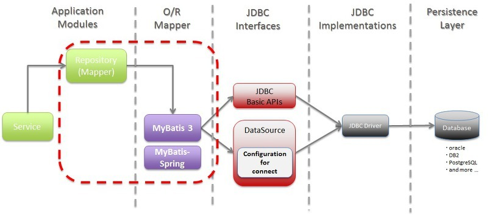

10_01
----

<br/>

# Spring - part 3 

## Bean Life Cycle 


해당 Aware Interface를 구현해야 사용 가능하다.  그안에는 구현해야 하는 메서드를 정의해 놓았다.  예시로 보자

```java
import org.springframework.beans.factory.BeanNameAware;
import org.springframework.beans.factory.FactoryBean;

import spring.service.domain.User;

public class UserFactoryBean implements FactoryBean{
	//constructor
    public UserFactoryBean() {
		System.out.println("\n ::"+getClass().getName() + " 디폴트 생성자...");
	}
	@Override
	public User getObject() throws Exception {
		System.out.println(":: " + getClass().getName()+ " getObject()");
		return new User();
	}
	@Override
	public Class getObjectType() {
			System.out.println(":: "+ getClass().getName() + " getObjectType()");
		return User.class;
	}	
	@Override
	public boolean isSingleton() {
		System.out.println(":: "+getClass().getName()+ " isSingleton()");
//		return true;
		return false;
	}
}

```
해당 구현 해야 하는 getObject(), getObjectType()가 정의 되어있고, isSingleton()은 구현 해도 되고 안해도 된다.

- getObject()  
getInstance()와 같은 동일한 역활을 해준다 .
- getObjectType()  
해당 객체를 가져올 때 어떠한 데이터 타입으로 가져올지 정하는 역활.
- isSingleton()  
T면 singleton ! 즉, 하나의 인스턴스를 생성하고 재사용 한다.  
F면 생성될때 마다 새로 생성 된다. 그러므로 F를 하게 되었을 경우 getObjectType를 정의해주지 않아도 되게 된다. **(getObjectType 미호출)**

하지만 Bean Life Sycle의 조건이 있는 것 같다.   
instance 될 class는 생성자, 필드, 자기 자신을 리턴하는 메서드는 **Private**로 지정이 되야 한다.

※자기 자신만 생성 해야 하는 객체는 싱글톤 패턴이라 부른다※

<br/>

# MyBatis

## MyBatis란 ?

자바에서 관계형 데이터 베이스 프로그래밍을 좀더 쉽게 도와주는 프레임워크.  
JDBC를 통해 데이터 베이스에 엑세스 하는 작업을 캡슐화 하고 SQL쿼리, 저장 및 고급 매핑을 지원하고 C&P를 제거 해준다. SQL쿼리들을 한 구성 파일로 만들어 프로그램 코드와 SQL쿼리를 분리 하는 모듈화 시켜주는 장점이 있다. 하지만 여러가지 프레임워크가 존재한다.

## 특징
- 복잡한 쿼리나 다이나믹 한 쿼리에 강점. 
- 프로그램 코드와 SQL쿼리를 분리 - 코드의 간결성, 유지보수가 좋아진다.
- ValueObject class에 프로그래밍 코드로 직접 담는것이 아닌 mapping하여 사용할 수 있다. 그리고 이것을 binding 이라 부른다.

## 구조




## meta data
- ~mapper.xml   
SQL을 관리하는 데이터 파일
- config.xml   
properties를 관리하는 데이터 파일, 이 안에서도 하드코딩을 선호하지 않는다.  
해당 참조 링크 [LINK](https://mybatis.org/mybatis-3/ko/configuration.html)

### meta data 대입자
JDBC에서 `?`로 썻던 대입자를 `#{}` / `${}`로 사용한다.

## selectList() :: selectOne()

- **selectList()**  
쿼리의 결과 값을 `List<E>`로 반환. 결과값이 없을 시 빈 껍데기를 반환한다.  
(Null 을 반환하지 않는다.)

- **selectOne()**  
쿼리 결과가 없으면 null을 반환한다.  
쿼리 결과로 레코드가 하나만 나와야 한다.  
만약 DB에 다수의 레코드가 있을 시 **TooManyResultsException** 발생

## SqlSession 사용

마이바티스에서는 `SqlSession`를 생성하기 위해 `SqlSessionFactory`를 사용한다